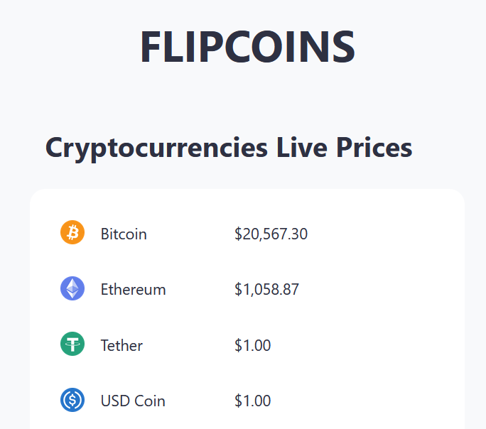

# FLIPCOINS


<br />

This is a [Next.js](https://nextjs.org/) project bootstrapped with [`npx create-next-app@latest --ts`](https://nextjs.org/docs/basic-features/typescript)  with TypeScript support

The app fetches Cryptocurrencies prices, exchanges & news from [CoinStats API](https://documenter.getpostman.com/view/5734027/RzZ6Hzr3?version=latest)


In the `Pages` directory will find JSX React components, Each page is associated with a route based on its file name, for example:<br />
`index.tsx` is associates with main route '/'<br />
`news.tsx` is associated with the news route '/news' <br />


In the `styles` directory you will find all styling sheets files `.css`

You can define all types, interfaces ... in `types.ts` file in root directory

`GetStaticProps` method is followed to fetch coins data from the API as in NextJs docs<br />
[https://nextjs.org/docs/basic-features/data-fetching/get-static-props](https://nextjs.org/docs/basic-features/data-fetching/get-static-props)
```
export async function getStaticProps() {
  // Call an external API endpoint to get posts.
  // You can use any data fetching library
  const res = await fetch('https://.../posts')
  const posts = await res.json()

  // By returning { props: { posts } }, the component
  // will receive `posts` as a prop at build time
  return {
    props: {
      posts,
    },
  }
```

you may check other Data fetching methods in the link below
[https://nextjs.org/docs/basic-features/data-fetching/overview](https://nextjs.org/docs/basic-features/data-fetching/overview)

<br />
<br />

## Getting Started with Docker

Frist build the Docker image
```
docker build -t cryptoapp .
```


then, start the Docker container locally
```
docker run --name cryptoapp -p 3000:3000 cryptoapp
```

Open [http://localhost:3000](http://localhost:3000) with your browser to see the result.

<br />
<br />


## Getting Started with NPM

First, run the development server:

```bash
npm run dev
# or
yarn dev
```

Open [http://localhost:3000](http://localhost:3000) with your browser to see the result.

You can start editing the page by modifying `pages/index.tsx`. The page auto-updates as you edit the file.

[API routes](https://nextjs.org/docs/api-routes/introduction) can be accessed on [http://localhost:3000/api/hello](http://localhost:3000/api/hello). This endpoint can be edited in `pages/api/hello.ts`.

The `pages/api` directory is mapped to `/api/*`. Files in this directory are treated as [API routes](https://nextjs.org/docs/api-routes/introduction) instead of React pages.

## Learn More

To learn more about Next.js, take a look at the following resources:

- [Next.js Documentation](https://nextjs.org/docs) - learn about Next.js features and API.
- [Learn Next.js](https://nextjs.org/learn) - an interactive Next.js tutorial.

You can check out [the Next.js GitHub repository](https://github.com/vercel/next.js/) - your feedback and contributions are welcome!

## Deploy on Vercel

The easiest way to deploy your Next.js app is to use the [Vercel Platform](https://vercel.com/new?utm_medium=default-template&filter=next.js&utm_source=create-next-app&utm_campaign=create-next-app-readme) from the creators of Next.js.

Check out our [Next.js deployment documentation](https://nextjs.org/docs/deployment) for more details.
